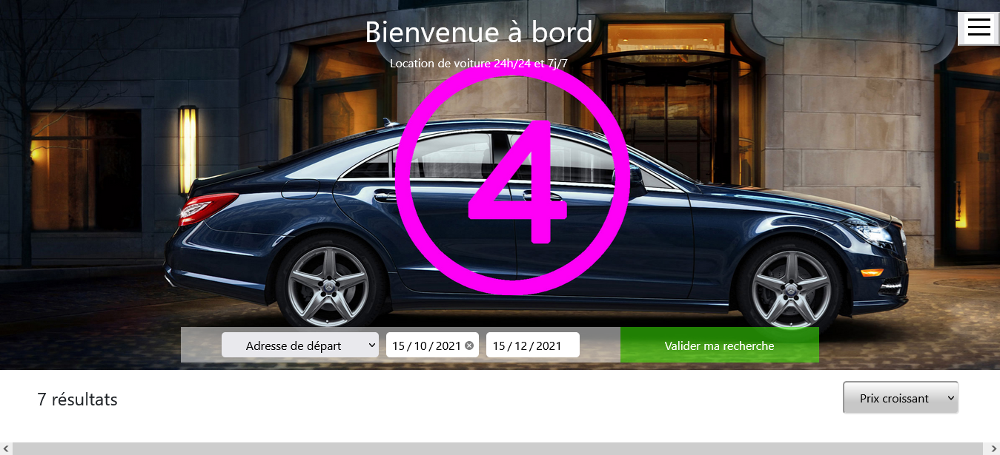

<div id="top"></div>

<div align="center">
  <h1> Test | Front End  </h1>
  <p> Integrate skecth with limit time. </p>
</div>

***

### Table of Content
1. [General Info](#general-info)
3. [Visual](#visual)
4. [Technologies](#technologies)
5. [Installation](#installation)
6. [Road Map](#roadmap)
7. [Contributing](#contributing)
8. [Contact](#contact)
<p align="right">(<a href="#top">back to top</a>)</p>

***

### General Info
In this repository I integrate a simple sketch with css grid.  
<p align="right">(<a href="#top">back to top</a>)</p>

***

### Visual
Here is an overview of project. </br>
</br>
<div align="center">
  
</div>
<p align="right">(<a href="#top">back to top</a>)</p>

***

### Technologies
- HTML 5
- CSS 3
- Javascript
- W3C validator
- LightHousse Chrome plugin

<p align="right">(<a href="#top">back to top</a>)</p>

***

### Installation

1. Clone the project
```
git clone https://github.com/LiseRochat/Test-Front-End
```
2. Open file with you text editor 
3. Run index.html in your navigator
<p align="right">(<a href="#top">back to top</a>)</p>

***

### Road Map
- [x] Integration HTML
- [x] Stylisation CSS
- [x] Responsive
    - [x] Tablet
    - [x] Mobile
- [x] Javascript
<p align="right">(<a href="#top">back to top</a>)</p>

### Contributing
If you have a suggestion that would make this better, please fork the repository and create a pull request. You can also simply open an issue with the tag "enhancement".

Don't forget to give the project a star! Thanks again!

1. Fork the Project
2. Create your Feature Branch (`git checkout -b feature/AmazingFeature`)
3. Commit your Changes (`git commit -m 'Add some AmazingFeature'`)
4. Push to the Branch (`git push origin feature/AmazingFeature`)
5. Open a Pull Request
<p align="right">(<a href="#top">back to top</a>)</p>

***

### Contact 
Rochat Lise - liserochat@live.fr </br>
Project Link: [https://github.com/LiseRochat/Test-Front-End](https://github.com/LiseRochat/Test-Front-End)
<br>
Source : [https://fromscratch.podia.com/](https://fromscratch.podia.com/view/courses/parcours-complet-mastering-front-end/)
<br>
<p align="right">(<a href="#top">back to top</a>)</p>


